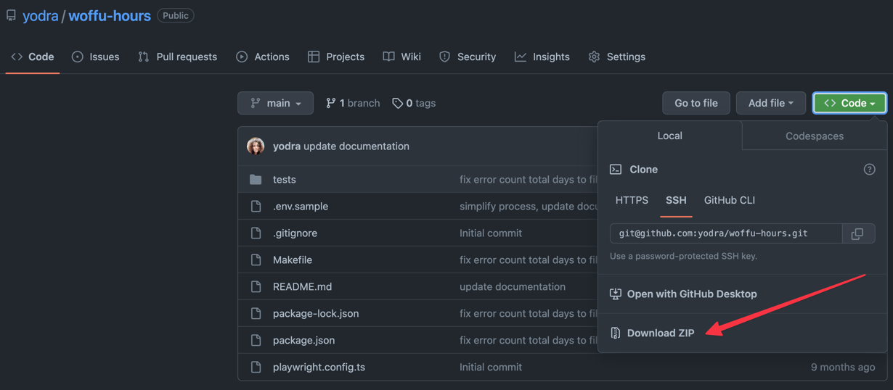
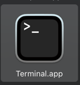

# Woffu hours

Fill hours in Woffu automatically

## ⚙️ Pre requirements

### Download

Download this project and unzip it.



### Installation

You need to install:
- [brew](https://brew.sh/).
- [Node](https://nodejs.org/en/). `brew install node`
- [Playwright](https://playwright.dev/). `npx playwright install`

👀 Execute the following command to install the pre requirements:

````shell
make install
````

📝 **Note:** To execute the commands you need to open the terminal application:



### Configuration 

Duplicate the `.env.sample` file and change the name to `.env`.
Check the file and make sure to update the values with your personal information:

- EMAIL: that you use to login in Woffu
- PASSWORD: that you use to login in Woffu
- HAS_GOOGLE_LOGIN: `true` if you use Google to login if it is not `false`
- TOTAL_MONTH: number of total month you need to fill
- INI_HOUR: The hour you want fill as **the initial hour in your day**
- END_HOUR: The hour you want fill as **the end hour in your day**
- WOFFU_URL: The url you use to login in Woffu

🙋‍♀ **️Remember**: The total hours between the initial and end hour can't be greater than 8h

File example:

```
EMAIL=youremail@yourcompany.com
PASSWORD=yourpassword
HAS_GOOGLE_LOGIN=true
TOTAL_MONTH=3
INI_HOUR=09:30
END_HOUR=17:30
WOFFU_URL=https://your_company.woffu.com
```

## 👷‍♀️ Install

Execute the following command to install it:

```shell
npm run i
```

## 🚀 Fill hours 

### with user and password

To fill your hours in Woffu execute the following command:

```shell
make fill-hours
```

To fill your hours and show the process execute: 

```shell
make fill-hours-headed
```

📝 **Note:** Always you can fill your hours check before the configuration in `.env` file.
